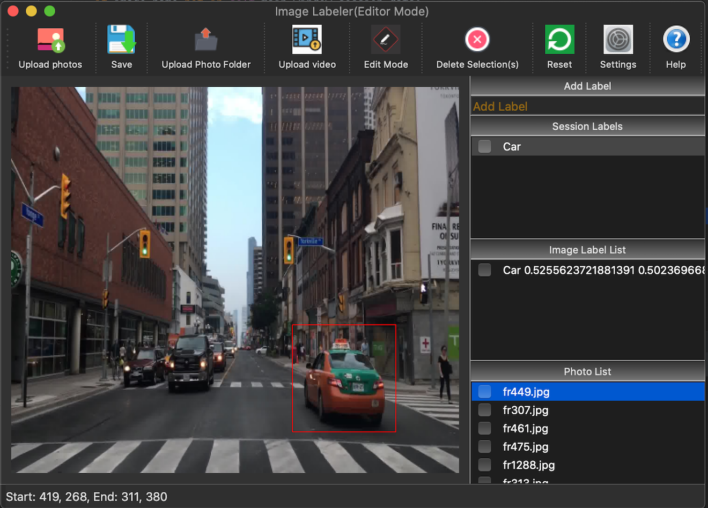

<h1 align="center">Welcome to labelpix 👋</h1>
<p>
  
  <a href="https://github.com/emadboctorx/labelpix/blob/master/LICENSE" target="_blank">
    
  </a>
</p>

> labelpix is a graphical image labeling interface for drawing bounding boxes.



### 🏠 [Homepage](https://github.com/emadboctorx/labelpix)

## Install

```sh
pip install -r requirements.txt
```

## Usage

```sh
python3 labelpix.py
```

## Features
* Preview and edit interfaces.
* Save bounding box relative coordinates to csv / hdf formats.
* Save relative object coordinates in yolo annotation.

## Instructions

* Upload photos.
* Add labels to session labels(ex: Dog, Car ...)
* Click on a photo from the photo list.
* Click on the desired label from the labels you added.
* Draw bounding boxes.
* Switch photos by scrolling/clicking on images in the list.
* Save data by entering filename_example.csv or filename_example.h5
* You can also save to yolo formatted txt outputs.
* For deleting any of the 3 right lists (session labels / Labels of the current image / Photo list) items, 
check item and press the delete button  

## Author

👤 **Emad Boctor**

* Github: [@emadboctorx](https://github.com/emadboctorx)

## 🤝 Contributing

Contributions, issues and feature requests are welcome!<br />Feel free to check 
[issues page](https://github.com/emadboctorx/labelpix/issues).

## Show your support

Give a ⭐️ if this project helped you!

## 📝 License

Copyright © 2020 [Emad Boctor](https://github.com/emadboctorx).<br />
This project is [MIT](https://github.com/emadboctorx/labelpix/blob/master/LICENSE) licensed.

***
_This README was generated with ❤️ by [readme-md-generator](https://github.com/kefranabg/readme-md-generator)_
